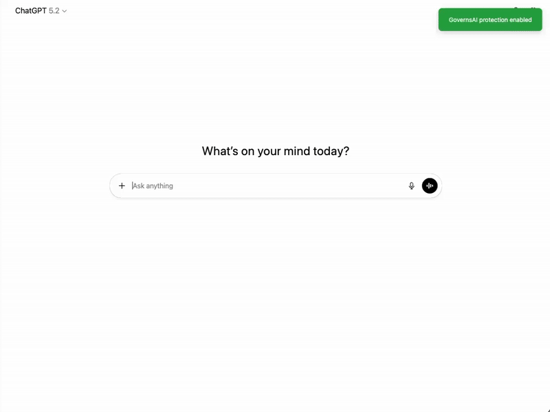

# pii-guard

Stops you from accidentally sending PII to ChatGPT, Claude, and Gemini.

## Why this exists

AI chat interfaces make it too easy to paste sensitive data. This extension intercepts your messages, detects PII (emails, phone numbers, SSNs, credit cards, etc.), and either redacts or blocks the message before it hits the AI provider.



## Status: Alpha / Works Locally

- ✅ Intercepts ChatGPT, Claude, Gemini
- ✅ PII detection via Precheck API
- ✅ Auto-redaction
- ✅ Dashboard logging (optional)
- 🚧 Chrome Web Store submission pending

## Install (Dev Mode)

1. Clone this repo
2. Chrome → `chrome://extensions/` → Enable Developer Mode
3. Load unpacked → select this folder
4. Done

**Note**: Local mode works without an API key if you run Precheck locally. Console mode requires a free API key from governsai.com.

## Configure

Click the extension icon → Settings:
- **Local mode**: Runs on `localhost:8000` (privacy-first, no data leaves your machine, no API key required)
- **Console mode**: Uses GovernsAI dashboard at `app.governsai.com` (requires API key for logging/policies)

## How it works
```
User types message → Extension intercepts → Precheck API scans → Policy applied → Action taken
     ↓                      ↓                       ↓                  ↓              ↓
  ChatGPT/              Content Script          PII Detection      Server Policy    Allow/
  Claude/Gemini                                                                    Redact/Block
```

**Three simple steps:**
1. **Intercept**: Extension catches your message before it's sent to ChatGPT, Claude, or Gemini
2. **Analyze**: Precheck API scans for sensitive information (PII) and applies your organization's policies
3. **Protect**: Based on policy, the message is either allowed, has PII redacted, or is blocked entirely

## License

MIT

## Contributing

It works but it's rough. PRs welcome, especially for:
- Additional PII patterns
- Better UI/UX
- More AI platform support
